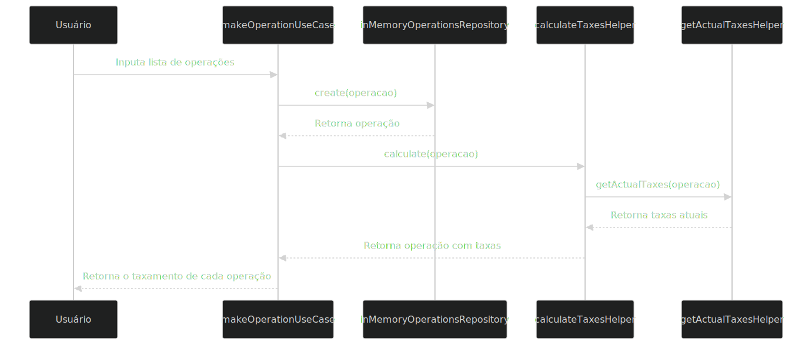

<div align="center">
  
  <br>
  
  
  

  <h1 align="center">CAPITAL GAINS</h1>
</div>

# Description

O `capital-gains` é responsável por processar pedidos de compras ou vendas de ações e calculcar a taxação individualmente de cada operação

## Decisões Técnicas e Arquiteturais

Optei por uma abordagem funcional em JavaScript, seguindo alguns princípios do SOLID, como o *Single Responsibility Principle* e o *Dependency Inversion Principle*
a decisão foi manter a arquitetura simples, intuitiva e fácil de entender, onde o foco é em resolver o problema. Além disso, utilizei os seguintes patterns:
- [**Repository Pattern**](/src/repositories/): para abstrair o acesso aos dados.
- [**Factory Pattern**](/src/useCases/operations/factory.js): para a criação e configuração de instâncias de objetos.
- [**InMemoryDatabase Pattern**](/src/repositories/inMemory/inMemoryOperationsRepository.js): para simular um banco de dados em memória, facilitando testes e desenvolvimento.
> Os detalhes de uma tecnologia estão sempre mudando. Foque nos princípios. Dedique seu tempo e energia mental para entender conceitos e ideias, e concentre-se nos problemas a serem resolvidos." — Rich Hickey

Para processar cada operação individualmente conforme a lista de input do usuário, optei por usar funções de array do JavaScript. as mais utilizadas foram:

- [**`Array.prototype.reduce()`**](https://developer.mozilla.org/pt-BR/docs/Web/JavaScript/Reference/Global_Objects/Array/reduce).
- [**`Array.prototype.map()`**](https://developer.mozilla.org/pt-BR/docs/Web/JavaScript/Reference/Global_Objects/Array/map).

### Testes unitários

Para os testes unitários, escolhi o [Vitest](https://vitest.dev/), uma ferramenta moderna para testes em JavaScript e TypeScript, construída com base no ESBuild o mesmo motor utilizado por ferramentas como Vite e TSX. O Vitest se destaca por sua integração nativa com TypeScript, eliminando a necessidade de configurações adicionais. Em comparação, o [Jest](https://jestjs.io/pt-BR/) requer configurações extras para suportar ESModules e TypeScript.

### Linter

Para o lint do código, utilizei o [StandardJS](https://standardjs.com/), que possui todas as regras de linting nativamente, dispensando configurações adicionais no editor. O StandardJS também elimina a necessidade de ferramentas como Prettier ou qualquer outro configurador de lint no projeto.

## Payloads de exemplo

Você deve enviar o payload em formato JSON no terminal estando na mesma linha. Segue o formato a baixo para copiar e colar.

### Case 1
```json
[[{"operation":"buy","unit-cost":10.00,"quantity":100},{"operation":"sell","unit-cost":15.00,"quantity":50},{"operation":"sell","unit-cost":15.00,"quantity":50}]]
```

### Case 2
```json
[[{"operation":"buy","unit-cost":10.00,"quantity":10000},{"operation":"sell","unit-cost":20.00,"quantity":5000},{"operation":"sell","unit-cost":5.00,"quantity":5000}]]
```

### Case 1 + Case 2
```json
[[{"operation":"buy","unit-cost":10.00,"quantity":100},{"operation":"sell","unit-cost":15.00,"quantity":50},{"operation":"sell","unit-cost":15.00,"quantity":50}], [{"operation":"buy","unit-cost":10.00,"quantity":10000},{"operation":"sell","unit-cost":20.00,"quantity":5000},{"operation":"sell","unit-cost":5.00,"quantity":5000}]]
```

### Case 3
```json
[[{"operation":"buy","unit-cost":10.00,"quantity":10000},{"operation":"sell","unit-cost":5.00,"quantity":5000},{"operation":"sell","unit-cost":20.00,"quantity":3000}]]
```

### Case 4
```json
[[{"operation":"buy","unit-cost":10.00,"quantity":10000},{"operation":"buy","unit-cost":25.00,"quantity":5000},{"operation":"sell","unit-cost":15.00,"quantity":10000}]]
```

### Case 5
```json
[[{"operation":"buy","unit-cost":10.00,"quantity":10000},{"operation":"buy","unit-cost":25.00,"quantity":5000},{"operation":"sell","unit-cost":15.00,"quantity":10000},{"operation":"sell","unit-cost":25.00,"quantity":5000}]]
```

### Case 6
```json
[[{"operation":"buy","unit-cost":10.00,"quantity":10000},{"operation":"sell","unit-cost":2.00,"quantity":5000},{"operation":"sell","unit-cost":20.00,"quantity":2000},{"operation":"sell","unit-cost":20.00,"quantity":2000},{"operation":"sell","unit-cost":25.00,"quantity":1000}]]
```

### Case 7
```json
[[{"operation":"buy","unit-cost":10.00,"quantity":10000},{"operation":"sell","unit-cost":2.00,"quantity":5000},{"operation":"sell","unit-cost":20.00,"quantity":2000},{"operation":"sell","unit-cost":20.00,"quantity":2000},{"operation":"sell","unit-cost":25.00,"quantity":1000},{"operation":"buy","unit-cost":20.00,"quantity":10000},{"operation":"sell","unit-cost":15.00,"quantity":5000},{"operation":"sell","unit-cost":30.00,"quantity":4350},{"operation":"sell","unit-cost":30.00,"quantity":650}]]
```

### Case 8
```json
[[{"operation":"buy","unit-cost":10.00,"quantity":10000},{"operation":"sell","unit-cost":50.00,"quantity":10000},{"operation":"buy","unit-cost":20.00,"quantity":10000},{"operation":"sell","unit-cost":50.00,"quantity":10000}]]
```

### Exemplo de documento criado no repositório em [memória](/src/repositories/inMemory/inMemoryOperationsRepository.js):

```json
[
  {
    "id": "74656e58-f3c1-4602-8393-8be14e30a09e",
    "operations": [
      {
        "operation": "buy",
        "unit-cost": 10,
        "quantity": 10000,
      },
      {
        "operation": "sell",
        "unit-cost": 50,
        "quantity": 10000,
      },
      {
        "operation": "buy",
        "unit-cost": 20,
        "quantity": 10000,
      },
      {
        "operation": "sell",
        "unit-cost": 50,
        "quantity": 10000,
      },
    ],
  },
]
```

## Tecnologias

Esse software utilizou as tecnologias:

<ul>
  <li>
    <a href="https://nodejs.org/">
      
      Node 20.17.0 or higher
    </a>
  </li>
  <li>
    <a href="https://vitest.dev/">
      
      Vitest
    </a>
  </li>
  <li>
    <a href="https://standardjs.com/">
      
      StandardJS
    </a>
  </li>
</ul>

## Commands
Comandos de input utilizado no projeto

### `Insira as operações em formato JSON: `

Responsável por receber a lista de operações que serão taxadas ou não.



### Example Return

Retorno de sucesso para o #Case1.

```json
[[{ tax: 0.00 }, { tax: 0.00 }, { tax: 0.00 }]]
```

Retorno de sucesso para o #Case1 + #Case2.

```json
[[{ tax: 0.00 }, { tax: 0.00 }, { tax: 0.00 }],
 [{ tax: 0.00 }, { tax: 10000.00 }, { tax: 0.00 }]]
```

Retorno de sucesso para o #Case3.

```json
[[{ tax: 0.00 }, { tax: 0.00 }, { tax: 1000.00 }]]
```

Retorno de sucesso para o #Case4.

```json
[[{ tax: 0.00 }, { tax: 0.00 }, { tax: 0.00 }]]
```

Retorno de sucesso para o #Case5.

```json
[[{ tax: 0.00 }, { tax: 0.00 }, { tax: 0.00 }, { tax: 10000.00 }]]
```

Retorno de sucesso para o #Case6.

```json
[[{ tax: 0.00 }, { tax: 0.00 }, { tax: 0.00 }, { tax: 0.00 }, { tax: 3000.00 }]]
```

Retorno de sucesso para o #Case7.

```json
[[{ tax: 0.00 }, { tax: 0.00 }, { tax: 0.00 }, { tax: 0.00 }, { tax: 3000.00 },
  { tax: 0.00 }, { tax: 0.00 }, { tax: 3700.00 }, { tax: 0.00 }]]
```

Retorno de sucesso para o #Case8.

```json
[[{ tax: 0.00 }, { tax: 80000.00 }, { tax: 0.00 }, { tax: 60000.00 }]]
```

Aqui está a versão reformulada e mais elegante para a seção de execução e testes da aplicação:

---

## Executando a Aplicação em Ambiente de Desenvolvimento

1. **Instale as dependências**:
   ```bash
   npm install
   ```

2. **Verifique a instalação do Node.js**:
   - Certifique-se de que o Node.js está instalado. Caso contrário, instale-o [aqui](https://nodejs.org/en/download/package-manager).

3. **Inicie a aplicação**:
   ```bash
   node src/index.js
   ```

4. **Insira um payload de operações**:
   - Após iniciar, escolha um dos exemplos listados na seção [Payloads de Exemplo](#payloads-de-exemplo) e insira no terminal quando solicitado.


   ```bash
   node src/index.js
   ```

   **Exemplo de entrada**:
   ```
   Insira as operações em formato JSON: [[{"operation":"buy","unit-cost":10.00,"quantity":100},{"operation":"sell","unit-cost":15.00,"quantity":50},{"operation":"sell","unit-cost":15.00,"quantity":50}]]
   ```

## Executando Testes

### Para rodar todos os testes:
   ```bash
   npm test
   ```

### Para gerar um relatório de cobertura com Vitest:
   ```bash
   npm run test:coverage
   ```

### Para visualizar a interface do Vitest:
   ```bash
   npm run test:ui
   ```
